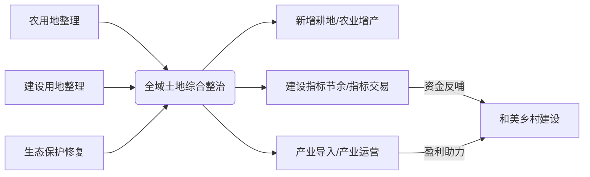

# 步骤4：方案包装提示词

> 用于指导AI完成政策文件分析的第四步——方案包装与呈现

---

## 任务目标

将专业方案转化为打动决策者的"商业故事"和"视觉提案"，形成《项目包装核心要点》。

---

## 分析框架

### 1. 叙事框架

#### SCQA框架

```
S - Situation（情境）
    描述政策背景与区域现状
    ↓
C - Conflict（冲突）
    指出当前面临的核心挑战与痛点
    ↓
Q - Question（问题）
    提出关键待解决问题
    ↓
A - Answer（答案）
    隆重推出我们的解决方案与服务产品
```

#### 英雄之旅框架

```
1. 平凡世界：描述现状
2. 冒险召唤：发现问题/机遇
3. 拒绝召唤：面临的困难和犹豫
4. 遇见导师：我们的出现
5. 跨越门槛：决定采取行动
6. 考验/盟友/敌人：过程中的挑战
7. 核心磨难：最关键的挑战
8. 奖赏：获得解决方案
9. 归途：实施和落地
10. 重生：实现转变
11. 归来：成果展示
```

### 2. 可视化呈现（一图读懂）

如果用户要求生成“一图读懂”信息图，或者环境允许使用 Mermaid、PlantUML，请为每个核心包装项目生成相应的图表代码：

#### 一图读懂类型
| 类型 | 适用场景 | 核心要素 | 推荐工具 |
|-----|---------|---------|---------|
| **逻辑框架图** | 展示方案整体逻辑 | 层次结构、逻辑关系 | Mermaid (Mindmap / Flowchart) |
| **产业链图谱** | 展示产业规划 | 上下游关系、关键环节 | Mermaid (Flowchart) |
| **实施路径图** | 展示工作计划 | 时间节点、里程碑、责任主体 | Mermaid (Gantt) |
| **空间布局图** | 展示空间规划 | 功能分区、空间关系 | 文本结构化描述 |
| **对比分析图** | 展示优势对比 | 与竞争对手的对比 | Markdown 表格 |

### 3. 汇报版本设计

#### 3分钟电梯演讲版
- 一句话价值主张
- 核心痛点
- 解决方案
- 关键数据

#### 15分钟汇报版
- 背景分析
- 问题诊断
- 解决方案
- 价值呈现
- 案例佐证
- 下一步

---

## 输出格式

### 输出1：SCQA叙事框架

**S - 情境（Situation）**：
> [描述政策背景与区域现状]

**C - 冲突（Conflict）**：
> [指出当前面临的核心挑战与痛点]

**Q - 问题（Question）**：
> [提出关键待解决问题]

**A - 答案（Answer）**：
> [隆重推出我们的解决方案与服务产品]

### 输出2：项目包装核心要点

#### 一句话价值主张
> [用一句话概括项目的核心价值]

#### 三个核心创新亮点

| 亮点 | 描述 | 差异化价值 |
|-----|------|-----------|
| **亮点1**：[名称] | [描述] | [价值] |
| **亮点2**：[名称] | [描述] | [价值] |
| **亮点3**：[名称] | [描述] | [价值] |

#### 关键数据锚点

- 📊 [数据指标1]：[数值]
- 🏢 [数据指标2]：[数值]
- 💼 [数据指标3]：[数值]
- 💰 [数据指标4]：[数值]
- 🎯 [数据指标5]：[数值]

#### 核心逻辑图（一图读懂）
> [如果支持，优先使用 mermaid 代码绘制，例如逻辑框架图或产业链图谱]
```mermaid
[在此处编写 mermaid 图表代码]
```

### 输出3：汇报策略

| 汇报对象 | 侧重点 | 核心话术 |
|---------|-------|---------|
| [对象1] | [侧重点] | [话术] |
| [对象2] | [侧重点] | [话术] |
| [对象3] | [侧重点] | [话术] |

---

## 分析要点

### DO（应该做）

- [ ] 用故事化方式呈现方案
- [ ] 将复杂信息可视化
- [ ] 用数据增强说服力
- [ ] 针对不同对象准备不同版本
- [ ] 突出差异化优势
- [ ] 准备应对提问

### DON'T（不应该做）

- [ ] 不要使用过多专业术语
- [ ] 不要堆砌信息
- [ ] 不要回避问题和风险
- [ ] 不要过度承诺
- [ ] 不要抄袭他人方案
- [ ] 不要忽视视觉呈现

---

## 价值量化方法

### 直接价值量化

| 价值类型 | 量化指标 | 计算方法 |
|---------|---------|---------|
| **经济价值** | 投资拉动、产值增加、税收贡献 | 基于项目规模估算 |
| **社会价值** | 就业带动、受益人群、满意度提升 | 基于覆盖范围估算 |
| **环境价值** | 减排量、绿化面积、能耗降低 | 基于技术参数估算 |

### 间接价值量化

| 价值类型 | 量化指标 | 计算方法 |
|---------|---------|---------|
| **品牌价值** | 媒体曝光、荣誉获得、排名提升 | 基于影响力评估 |
| **战略价值** | 市场地位、竞争优势、发展潜力 | 基于对标分析 |

---

## 汇报话术模板

### 开场话术

| 场景 | 话术 |
|-----|------|
| 新政策机遇 | "[政策文件]的出台，为[城市名]带来了[领域]的重大发展机遇..." |
| 问题驱动 | "我们在调研中发现，[城市名]在[领域]存在一个亟待解决的突出问题..." |
| 对标差距 | "与[对标城市]相比，[城市名]在[领域]还有明显差距，亟需..." |

### 价值呈现话术

| 场景 | 话术 |
|-----|------|
| 政绩价值 | "项目建成后，将成为[城市名]的[定位]，写入[政府工作报告]..." |
| 经济价值 | "预计拉动投资[金额]，新增产值[金额]，创造税收[金额]..." |
| 社会价值 | "直接受益群众[人数]，创造就业岗位[数量]，满意度提升至[%]..." |

---

## 示例

### 背景

项目名称：宜宾三江新区 "智汇三江" 数字经济产业园 总体规划与招商运营方案

### 输出

**SCQA叙事框架**：

> **S - 情境**：数字经济已成为推动经济高质量发展的核心引擎。国家"十四五"规划明确提出，到2025年数字经济核心产业增加值占GDP比重达到10%。四川省正加快建设国家数字经济创新发展试验区，宜宾市作为全省经济副中心，亟需抢抓数字经济发展机遇，打造区域数字经济新高地。

> **C - 冲突**：当前，三江新区在数字经济发展中面临三大挑战：一是产业定位不够清晰，与成都、重庆等周边城市存在同质化竞争；二是数字基础设施相对薄弱，难以支撑产业快速发展；三是缺乏专业招商团队和运营经验，产业导入效果不佳。

> **Q - 问题**：如何在激烈的区域竞争中找准定位、差异化发展？如何科学规划空间布局，实现产城融合？如何设计可持续的运营模式，确保园区健康发展？

> **A - 答案**：我们提出"智汇三江"数字经济产业园总体规划方案，以"一核两带多园"为空间格局，聚焦工业互联网、数字文创、大数据服务三大主导产业，打造"川南数字经济第一园"。方案包含产业策划、空间规划、智慧设计、招商运营四大模块，提供从规划到落地的全链条服务。

**一句话价值主张**：
> "以顶层规划引领产业发展，以专业运营保障落地成效，助力三江新区打造川南数字经济新高地"

**三个核心创新亮点**：

| 亮点 | 描述 | 价值 |
|-----|------|------|
| **亮点1：产业定位创新** | 基于宜宾产业基础，提出"工业互联网+白酒""工业互联网+竹产业"特色赛道 | 差异化竞争，错位发展 |
| **亮点2：空间模式创新** | 首创"产城人境"融合的智慧园区空间模型 | 提升园区品质和吸引力 |
| **亮点3：运营模式创新** | 设计"政府引导+平台运营+企业主体"三级运营体系 | 确保可持续发展 |

**关键数据锚点**：

- 📊 **产业规模**：到2027年，园区数字经济产值突破**200亿元**
- 🏢 **企业数量**：引进培育数字经济企业**500家**以上
- 💼 **就业带动**：创造高质量就业岗位**1万个**
- 💰 **投资拉动**：带动社会投资**100亿元**
- 🎯 **税收贡献**：年税收贡献**10亿元**

**核心逻辑图（一图读懂）示例**：
以“全域土地综合整治”项目为例，逻辑如下：


**汇报侧重点建议**：

| 汇报对象 | 侧重点 | 话术要点 |
|---------|-------|---------|
| **市委书记/市长** | 战略价值、政绩亮点 | "打造省级数字经济标杆，写入市政府工作报告" |
| **分管副市长** | 实施路径、风险可控 | "分期建设、滚动开发，确保投资效益" |
| **发改/工信部门** | 政策合规、资金保障 | "已对接省级专项资金，申报成功率高" |
| **园区管委会** | 操作便利、落地可行 | "提供招商企业清单，协助对接头部企业" |

---

## 执行指令

请基于步骤3的项目策划结果，进行方案包装，输出：

1. SCQA叙事框架
2. 项目包装核心要点（一句话价值主张、三个核心创新亮点、关键数据锚点、核心逻辑图）
3. 汇报策略（针对不同层级领导的侧重点和话术）

分析过程中，如有需要澄清的信息，请及时提出。
